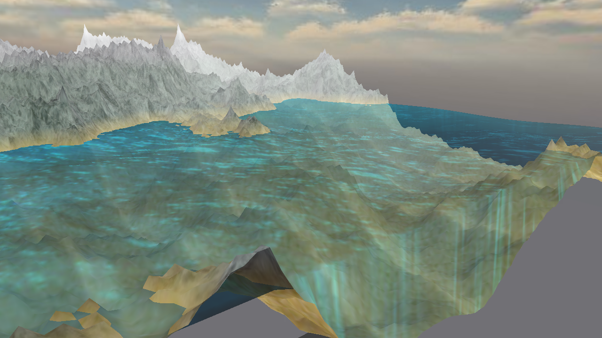

# Landscape Visualization



* Skyboxes: 4
* Blend water
* Waves imitation
* Fog

## Control keys
    key '1': Landscape visualization with texture (default)
    key '2': Landscape normals visualization with color
    key '3': Landscape visualization with color
    SPACE - carcass view
    ESC - exit

## Launch

shell script

    bash run.sh # make and run
    bash clean.sh # clean project

or

    mkdir build
    cd build 
    cmake ..
    make
    ./landscape 

## Render setting up 
You can change flags to set up scene: _[include/landscape.h](include/landscape.h)_

```cpp
/***** can change *****/
const float roughness = 0.3; // landscape roughness  
const int map_height = 85; // max landscape height
const std::string pick_sky = "4";  // 1-4 pick skybox'a
bool isRandom = true; // generate random landscape?
bool isMedian = false; // use median filter at landscape?
const int frame = 3; // redraw waves every 'frame'  (high - for high perfomance)
```

## Used libraries
glm, GLFW, SOIL

### Installing

        sudo apt-get install libglfw3-dev
        sudo apt-get install libglm-dev
        sudo apt-get install libsoil-dev
